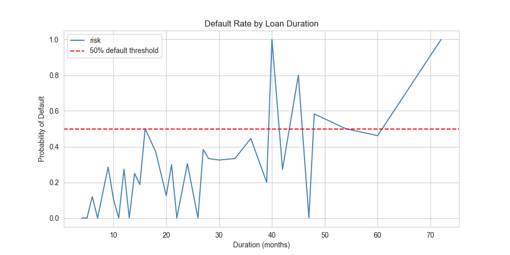
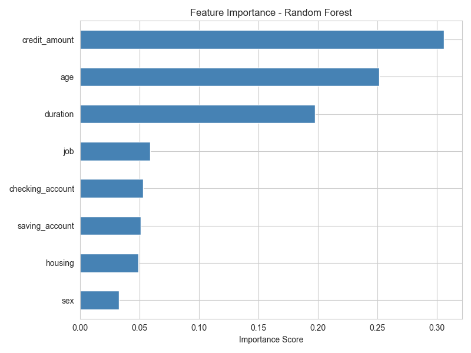
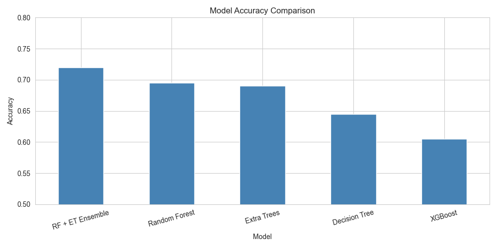
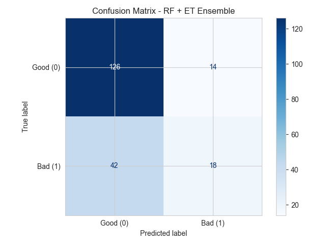
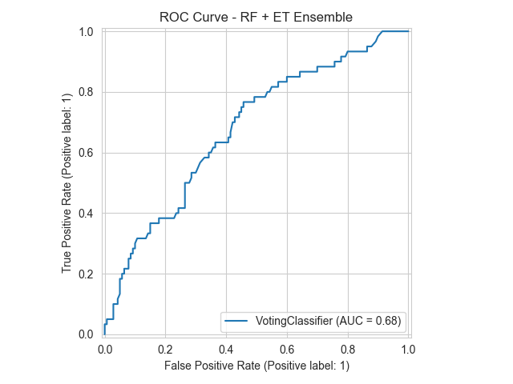

# German Credit Risk Analysis

A complete end-to-end machine learning project that predicts whether a loan applicant is low risk or high risk, based on financial and demographic information from the German Credit dataset.

---

## Project Overview

Credit risk analysis helps financial institutions determine how likely a borrower is to repay a loan. Without it, banks give loans blindly and risk significant financial losses. This project builds a machine learning pipeline that classifies applicants as **low risk (likely to repay)** or **high risk (likely to default)**, supporting smarter and fairer lending decisions.

This type of analysis is widely used in banking, fintech, insurance, and other financial services.

---

## Dataset

- **Source:** German Credit Dataset — UCI Machine Learning Repository (https://archive.ics.uci.edu/dataset/144/statlog+german+credit+data)
- **Size:** 1,000 applicants, 10 features
- **Target:** `risk` — 0 = Good (Low Risk), 1 = Bad (High Risk)
- **Class Distribution:** 700 low risk (70%) vs 300 high risk (30%) — imbalanced dataset

| Feature | Description |
|---|---|
| Age | Applicant age (19–75) |
| Sex | Male or Female |
| Job | Skill level (unskilled, skilled, highly skilled) |
| Housing | Own, rent, or free |
| Saving Account | little, moderate, quite rich, rich |
| Checking Account | little, moderate, rich |
| Credit Amount | Loan amount requested (250–18,424) |
| Duration | Loan duration in months (4–72) |
| Purpose | Reason for the loan |
| Risk | Target variable (0 = Low, 1 = High) |

---

## Project Structure

```
Credit_Risk_Analysis/
├── notebooks/
│   ├── 01_data_understanding.ipynb       # EDA and data exploration
│   └── 02_exploratory_data_analysis.ipynb # Feature engineering and modelling
├── visuals/
│   ├── numerical_distribution.png
│   ├── boxplots_by_risk.png
│   ├── boxplots_by_risk_numeric.png
│   ├── correlation_heatmap.png
│   ├── category_distributions.png
│   ├── category_by_risk.png
│   ├── age_credit_scatter.png
│   ├── violin_saving_account.png
│   ├── duration_tipping_point.png
│   ├── feature_importance.png
│   ├── model_comparison.png
│   ├── confusion_matrix.png
│   └── roc_curve.png
├── data/
│   └── German_Credit.csv
├── app.py                                # Streamlit web application
├── ensemble_credit_model.pkl             # Saved ensemble model
├── requirements.txt
└── README.md
```

---

## Workflow

### 1. Data Understanding
- Explored distributions of age, credit amount and loan duration
- Identified class imbalance: 70% good borrowers vs 30% bad borrowers
- Analysed categorical features: sex, job, housing, saving and checking accounts, purpose

### 2. Feature Engineering
The following new features were created to improve model performance:

| Feature | Description |
|---|---|
| `age_group` | Binned age into Young (18–34), Middle-aged (35–64), Retired (65–75) |
| `credit_per_month` | Credit amount divided by duration — monthly financial burden |
| `saving_score` | Numerical score mapped from saving account category |
| `checking_score` | Numerical score mapped from checking account category |

### 3. Encoding
- **Ordinal encoding** for `job` (unskilled=0, skilled=1, highly skilled=2)
- **Label encoding** for `sex`, `housing`, `saving_account`, `checking_account`
- Encoders saved as `.pkl` files for use in the Streamlit app

### 4. Modelling
Four models were trained and tuned using GridSearchCV with 5-fold cross-validation:

| Model | Accuracy |
|---|---|
| RF + ET Ensemble | **72.0%** |
| Random Forest | 69.5% |
| Extra Trees | 69.0% |
| Decision Tree | 64.5% |
| XGBoost | 60.5% |

Class imbalance was handled using `class_weight="balanced"` in tree-based models.

### 5. Ensemble Model
Based on a suggestion to combine the top two performing models, a **VotingClassifier** was built combining Random Forest and Extra Trees using soft voting. This improved accuracy from 69.5% to **72.0%**, making it the final deployed model.

---

## Key Findings and Observations

### Duration Tipping Point
Loan duration was found to be the **3rd most important predictor** of credit risk. Analysis revealed a clear tipping point around **40 months** — below this threshold, default rates stay mostly below 50%, but beyond 40 months the probability of default rises sharply and remains consistently high.



### Feature Importance
The top features driving credit risk predictions (based on Random Forest):

1. **Credit Amount** — the single most important factor
2. **Age** — older borrowers tend to be more reliable
3. **Duration** — longer loan periods increase default risk
4. **Job** — skill level has a moderate influence on repayment
5. **Checking Account** — financial stability indicator
6. **Saving Account** — financial stability indicator
7. **Housing** — minor influence
8. **Sex** — least influential feature



### Model Comparison
Random Forest and Extra Trees consistently outperformed XGBoost on this dataset. Combining them through ensemble voting produced the best result.



### Confusion Matrix
Out of 200 test applicants:
- 126 good borrowers correctly identified
- 18 high risk borrowers correctly identified
- 14 good borrowers incorrectly flagged as high risk
- 42 high risk borrowers missed (predicted as good)

The model performs better at identifying good borrowers than bad ones — a common outcome with imbalanced datasets. This highlights an area for improvement in Version 2.



### ROC Curve
AUC = 0.68 — the model performs significantly better than random chance (0.50) and shows decent discriminative ability for a dataset of this size and class imbalance.



---

## Streamlit App

A web application was built using Streamlit, allowing anyone to enter loan applicant details and instantly receive a prediction with a confidence score.

**To run locally:**

```bash
pip install -r requirements.txt
streamlit run app.py
```

**Input fields:**
- Age, Sex, Job Type, Housing
- Saving Account, Checking Account
- Credit Amount, Loan Duration

**Output:**
- Low Risk or High Risk classification
- Confidence percentage

---

## Requirements

```
pandas
numpy
scikit-learn
xgboost
matplotlib
seaborn
streamlit
joblib
```

Install all dependencies:
```bash
pip install -r requirements.txt
```

---

## Future Improvements (Version 2)

- Include engineered features (`age_group`, `credit_per_month`, `saving_score`, `checking_score`) in model training
- Add SHAP values for individual prediction explainability
- Address class imbalance using SMOTE oversampling
- Include `purpose` as a model feature
- Improve recall for high risk borrowers (currently 42 missed)
- Deploy on Streamlit Community Cloud for public access

---

## Tools and Technologies

- **Python** — pandas, numpy, scikit-learn, xgboost, matplotlib, seaborn
- **Machine Learning** — Decision Tree, Random Forest, Extra Trees, XGBoost, VotingClassifier
- **Model Tuning** — GridSearchCV with 5-fold cross-validation
- **Deployment** — Streamlit
- **Environment** — VS Code, Jupyter Notebooks, Virtual Environment

---

## Author

**Fatimo Yusuf**
Data Analyst | Microsoft Certified | Data Science | AI & Data Engineering Enthusiast

Connect with me on [LinkedIn](https://www.linkedin.com/in/fatimoyusuf)
